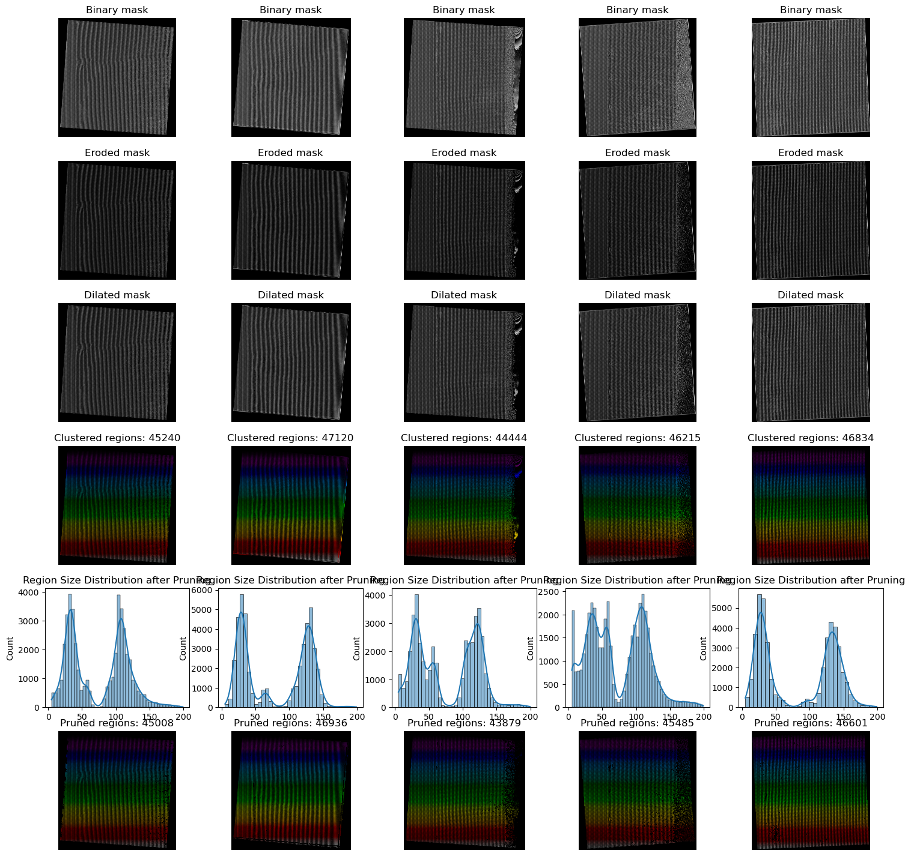
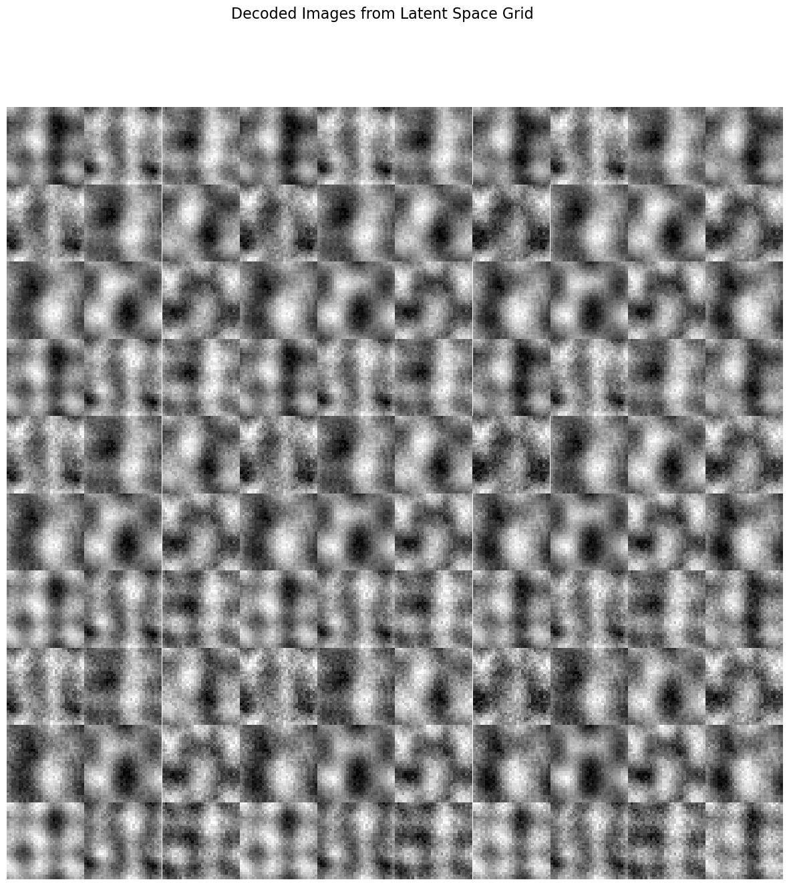
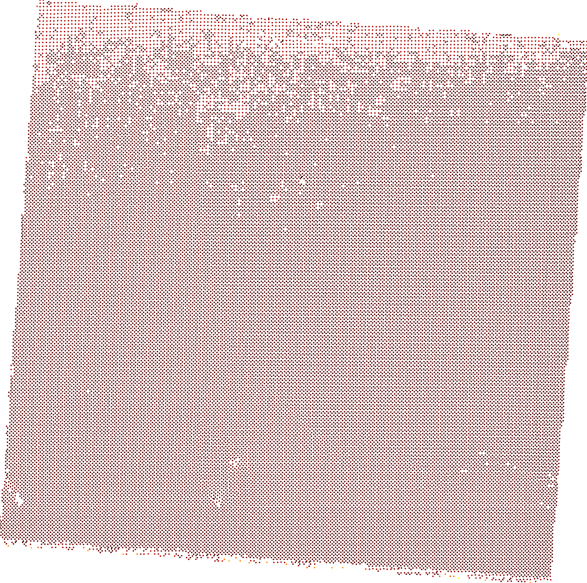
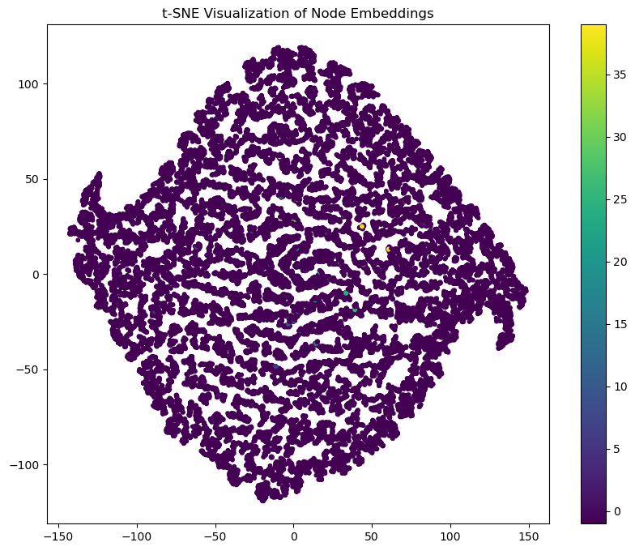

# Micrography

Micrography is a python package with the goal of incorporating graph data for the analysis of electron microscope images. 

## Abstract

Micrography introduces a novel graph-based framework for analyzing electron microscope images of materials, addressing fundamental limitations of traditional pixel-based approaches. While conventional methods like convolutional neural networks and autoencoders treat images as pixel arrays, our approach reconstructs the physical arrangement of molecules as graphs, where nodes represent individual molecules with their spatial and morphological features, and edges capture their nearest-neighbor relationships. This transformation preserves critical structural information that is often lost in pixel-space transformations. By applying graph neural networks to these molecular arrangements, we can detect subtle structural anomalies, characterize material properties, and identify defects with significantly improved interpretability. Our comparative analysis demonstrates that graph-based representations capture material properties that remain hidden to traditional methods, particularly in regions with structural irregularities. The framework lays groundwork for intelligent, guided microscopy that can autonomously direct imaging resources toward regions of scientific interest, fundamentally changing how electron microscopy is utilized in materials science research.

## Methodology

Our methodology combines image analysis with graph theory to create a more powerful and interpretable framework:

1. **Image Preprocessing and Molecular Identification:**
   - Raw STEM images undergo binarization, erosion, and dilation to isolate distinct molecular regions
   - Connected component analysis labels individual molecules
   - Size-based filtering removes artifacts and noise
   - Statistical features (centroid coordinates, spatial distribution, size) are extracted for each molecule

2. **Comparative Segmentation Approaches:**
   - Gaussian Mixture Models provide initial classification of molecular types
   - A Variational Autoencoder enhances segmentation, particularly in boundary regions
   - Statistical analysis of both approaches validates molecular classifications

3. **Graph Construction and Topological Analysis:**
   - Molecules become graph nodes with their extracted features as node attributes
   - K-nearest neighbor connections (K=4) establish edges between molecules, capturing physical proximity
   - Edge weights reflect the Euclidean distances between molecular centroids
   - Nearest neighbor distance distributions reveal material lattice properties and structural patterns

4. **Graph Neural Network Enhancement:**
   - A Graph Autoencoder learns embeddings that preserve both molecular features and their spatial relationships
   - The embedding space enables identification of structural motifs and anomalies not visible in pixel space
   - Unsupervised clustering in the embedding space reveals regions with similar characteristics
   - Graph visualization techniques provide intuitive interpretation of material properties

5. **Structural Insights Through Graph Analysis:**
   - Unusual nearest-neighbor distances highlight potential defect regions
   - Deviations in graph structure identify areas of material strain or lattice distortion
   - Neighborhood feature distributions reveal local material composition variations
   - Spatial correlation of graph features provides insights into long-range order and disorder

This graph-centric approach significantly augments traditional methods by explicitly preserving the spatial relationships between molecules, enabling multi-scale analysis from individual molecules to global structure, and providing a more physically interpretable representation that directly reflects the material's actual structure rather than pixel-based abstractions. The resulting framework not only improves defect detection but creates the foundation for guided microscopy where regions with unusual graph properties can be automatically targeted for more detailed examination.

| **Preprocessing** <br>  | **Variational Autoencoder (VAE) Latent Space** <br>  |
|:------------------------------------------------------------------------:|:------------------------------------------------------------------------------------------:|
| **Defect Detection** <br>  | **Graph Embedding** <br>  |

## Initial Goals
- [X] Efficiently extract graphs from electron microscope images
- [X] Compare interpretability to traditional Autoencoder
- [X] Explore material graph structure features
- [X] Use GNNs to predict defects in materials
- [ ] Use GNNs to guide an electron microscope to areas of interest

## Current State

We were able to complete quite a lot of work in a short amount of time, but were not able to fully reach our goal of using a GNN to predict unseen regions to guide a microscope to "interesting" regions. We hope to further develop this code to do so in the future, as well as explore more deeply how graphs can help us learn about and guide material imaging and discovery.

## Installation

To run this code, we recommend using a virtual environment. We support conda, uv, and pip. It is only necessary to use one of these methods, so choose the one that you are most comfortable with.

### Conda

We recommend using conda with the mamba solver, as it is much faster than the default conda solver. You can find a distribution through miniforge [repo](https://github.com/conda-forge/miniforge). Once this is installed, you can create an environment with the following command:

**Nvidia GPU**
```bash
mamba env create -f cuda_env.yml
mamba activate micrography
```

**CPU**
```bash
mamba env create -f cpu_env.yml
mamba activate micrography
```

### UV

`uv` is a replacement for `pip` which is faster and more reproducible. You can install it from [here](https://github.com/astral-sh/uv). Once you have `uv` installed, you can create a virtual environment with the following command:

```bash
uv venv
```

### Pip

If you prefer to use `pip`, you can install all dependencies into your current environment with the following command:

```bash
pip install -r requirements.txt
```

However, we recommend using a virtual environment to avoid conflicts with other packages.
```bash
python -m venv venv
source venv/bin/activate
pip install -r requirements.txt
```
## Data

Sample data for this repo is taken from [STEM images and associated parameters for Sm-doped BFO](https://doi.org/10.5281/zenodo.4555978).

## Usage

All examples in micrography are written in the form of `marimo` notebooks. These are reproducible and easily version controlled, unlike standard jupyter notebooks. They can additionally be run as standalone python scripts, making them much more ergonomic for development. For more information on `marimo`, see the [documentation](https://marimo.io/).

**NOTE**
This is tentative and will be updated as the project progresses. We are doing most of the current work in the `project.py` file, as well as standardized functions being written in the `pipeline.py` and `utils.py` files. We will move the final work to marimo notebooks for reproducibility and ease of use later.

